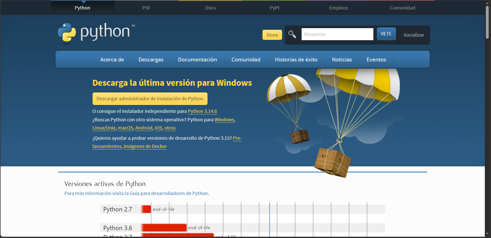
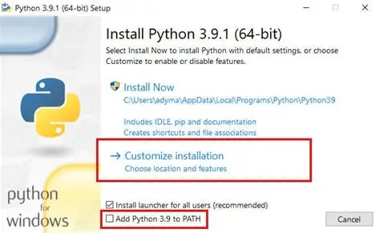
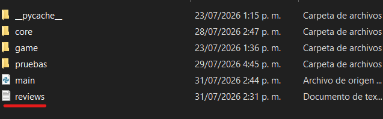

# 🎮 ProblemOffice 


## Versiones
- v2.5
- v3.0 (Proximamente)

## Desarrollador
Daniel Andrés Naranjo

## Lenguaje
Python 3.14

## Librerías
- colorama
- cowsay
- pyfiglet

## Descripción

ProblemOffice es un juego de terminal basado en decisiones.
El jugador deberá descubrir los secretos ocultos de una empresa
mientras toma decisiones que cambian el final del juego.

## Cómo ejecutar
 ### Contraseña del winrar
  - 2/1969
```bash
python main.py
## O si no te funciona
py main.py
```
## Paquetes para descargar
 - colorama
 - cowsay
 - pyfliglet
  ## Cómo descargarlo
```bash
pip install colorama
pip install cowsay
pip install pyfiglet
```
 ## Comprobar su instalación correcta
```bash
pip show colorama
pip show cowsay
pip show pyfiglet
```
 ## Python
para descargarlo: https://www.python.org/downloads/
  ### instrucciones
   - descarga el instalador
    
   - abrelo al apenas descargarlo y te saldra algo como esto:
    
   - presiona "siguiente" y en instalar
 ## Comprobación de una instalación correcta
```bash
python --version
```
  despues de haberlo instalado.
## Estado del proyecto

🟢 En desarrollo Continuo.

## Tener en Cuenta

Tu puedes reseñar el juego, asi que si tienes quejas o mejores avisarme mandando
tu review.txt en el juego.



## Gracias por tu atención y que te diviertas

Link de la pagina web: https://daniprogramer123.github.io/Problema-de-oficina/.